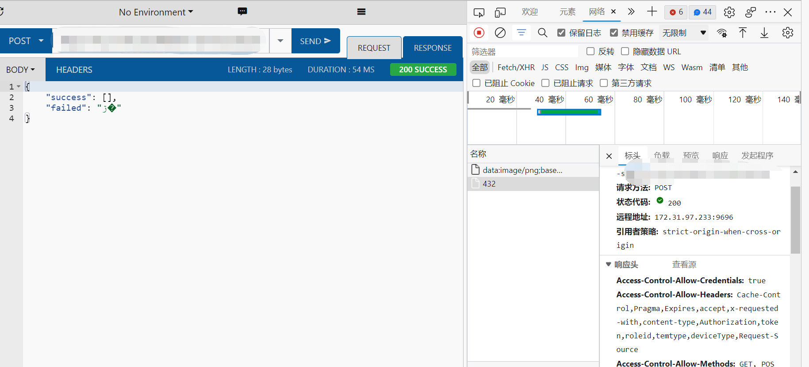

## QNetworkRequsts文件上传的流程


### 简介

​	做http文件上传中，遇到了很多问题，而且封装的也还不够稳定，但是算是将文件上传调通了，其中也有一些要关注的点: 

```
	1. http请求头
	2. 文件流处理
	3. QHttpPart表单封装
	4. QHttpMultiPart封包的标识
```

### 正文

#### 流程

##### 	1.分析接口

​			1.当拿到一个上传接口时，第一步要做的事情，在浏览器中F12找到相应的提交，找到实际访问的接口

​			2.就是使用postman插件进行模拟上传验证，如下（这里举例子的是一个本地服务器接口，所以打码了)



​			3.根据分析，这个文件上传的接口采用的是multipart表单的方式上传的，所以我们代码中需要模拟这种操作，而由于我的postman几乎其他的值都没有填也能正确返回,这个基本上就知道了其发送成功的流程

​			4.如果一直postman发送不成功，那么代码再怎么写也无法成功，所以一直要调试到能postman成功为止。

##### 2.代码编写

​	我这边确定了，采用multipart发送一个数据，需要有几个必要条件，1.发送post请求  2.请求头中告知数据封装的标识，对二进制数据进行封装。下面就来做一下实现。

```c++
// pro文件中 添加network，使用QNetworkRequests等进行post请求发送
Qt += network

// C++中
#include <QApplication>
#include <QtNetwork/QNetworkAccessManager>
#include <QtNetwork/QNetworkRequest>
#include <QtNetwork/QHttpMultiPart>
#include <QFile>

int main() {
    QApplication app;
    /******** 封装数据表单 **********/
    // 创建数据封装对象，注意，这个对象释放的时机需要等网络数据返回后才可以释放
	QHttpMultiPart *multiPart  = new QHttpMultiPart(QHttpMultiPart::FormDataType);
    // 设置数据封装标识
	multiPart->setBoundary(QByteArray("----WebKitFormBoundary7MA4YWxkTrZu0gW"));
	//打开文件
	QFile *file = new QFile("1.png");
	file->open(QIODevice::ReadOnly); 
    // 创建表单，实际的数据就是封装在其中的
    QHttpPart filePart;
	// 这里设置的是数据类型，注意，在postman中封装的状态可能图片是png，但是发png没用，
    // 所以这里首先使用的是"application/octet-stream"，如果不行再看postman中的进行封装
    filePart.setHeader(QNetworkRequest::ContentTypeHeader, QVariant("application/octet-stream"));
	// 设置解析的头，一般这里是和服务器约定的名称，和文件名称
    filePart.setHeader(QNetworkRequest::ContentDispositionHeader, QVariant("form-data; name=\"files\"; filename=\"" + file->fileName() + "\""));
    // 将数据填入表单---注意，这个接口封装过，减少了一次拷贝过程
    filePart.setBodyDevice(file);
	// 将表单前后进行添加"----WebKitFormBoundary7MA4YWxkTrZu0gW",封装完成
    file->setParent(multiPart);        

    
    /*********** 发送请求 *****************/
    // 创建manager对象
	QNetworkAccessManager *manager = new QNetworkAccessManager(this);
	QNetworkRequest request(QUrl("http://upload.com"));
    // 设置请求头，注意，这步是必须要的，否则服务器无法解析数据
    request->setHeader(QNetworkRequest::ContentTypeHeader, QVariant("multipart/form-data;boundary=" + multiPart->boundary()));
    // 发送请求
    QNetworkReply *reply = m_networkManage->post(request, part);
	// 等待返回
    QObject::connect(reply, &QNetworkReply::finished, [ = ]() {
    if (reply->error()) {
        qDebug() << "Error:" << reply->errorString();
    } else {
        qDebug() << "Success!";
        qDebug() << reply->readAll();
    }
}); 
    
	return app.exec();
}


```

​	上诉代码中都是必要步骤，缺少一步都可能会导致服务器解析失败，当如果做好了这些，服务器还是解析失败的话，一般就是服务器的问题了，需要联合后端一起解决。

​	总结一下，整个过程有几个要做的事情，从内到外如下：

```markdown
	1. 封装**QHttpPart**数据，将数据的类型，和文件类型，名称都要填写，然后再是数据。
	2. 通过**QHttpMultiPart**将整个表单数据封装起来，主要是添加**Boundary**在头尾，让服务器可以正确解析数据(**这里要注意QHttpMultiPart不能释放太早，因为QNetworkRequests是一个异步请求的过程，如果释放太早的话，程序中发送时可能已经读不到了，会产生崩溃**)
	3. 设置请求头告知**Boundary**的标识符
	4. 通过**QNetworkRequests**发送请求，并接收请求返回值
```

##### 3.QHttpPart表单封装

​	访问的时候，我们实际上是通过QHttpMultiPart类和QHttpPart封装了form表单，而这个表单的封装很简单，但是不被经常用到，具体写法如下

```c++
// 创建表单对象
QHttpMultiPart *multiPart  = new QHttpMultiPart(QHttpMultiPart::FormDataType);
// 设置表单的标识，将内容封装在其中
multiPart->setBoundary(QByteArray("----WebKitFormBoundary7MA4YWxkTrZu0gW"));
/***************** 表单内容(这里一般是和服务器约定的键值对) ****************/
QHttpPart tempPart;
// 设置数据key
tempPart.setHeader(QNetworkRequest::ContentDispositionHeader, QVariant(QString("key1")));
// 设置值
tempPart.setBody(QString("value").toUtf8());
// 添加到表单中
multiPart->append(tempPart);
/*************************如果有多个键值对重复以上步骤***************************/

// 发生步骤上方代码已经写了例子，不再赘述

```

